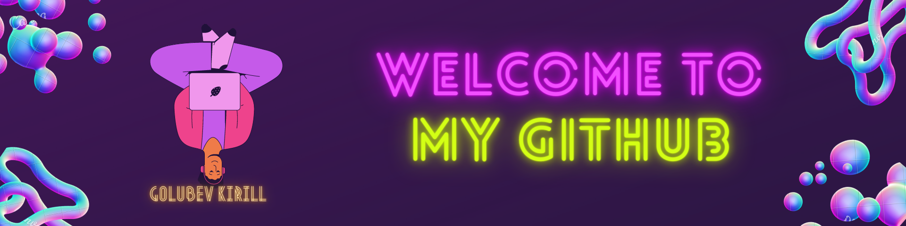

 

  Hello everyone, I am a novice Data analyst from Moscow.
   
   
   
  🎓 At the moment I am studying in the direction of Software Engineering (Applied Mathematics and Computer Science) at MEPhI
   
   
  💻 I love writing code and learn anythings about it
   
  📚 In addition, I am interested in mathematics, modern machine learning approaches and programming
   
    In addition to studying, I am fond of : ⚽ 🏀 📐 ♖  🛏
  
    👨🏻‍💻 You can check out my CV <a href="https://drive.google.com/file/d/1QoLo-Wl_rqEqUg-ZzMrcTJciNQ3zsN9X/view?usp=sharing" title="Issues">Here</a>
   
  💬 You can chat with me in telegram :   <a href="t.me/@llirik02468" title="Issues">@llirik02468</a>
   
  📫 How to reach me: <a href="mailto: polikir2@gmail.com">polikir2@gmail.com</a>

<h2 align="center">🔥 Languages & Frameworks & Tools & Abilities 🔥</h2>
 

<code></code>
  <code></code>
  <code></code>
  <code></code>
  <code></code>
  <code></code>
  <code></code>
  <code></code>
  <code></code>
  <code></code>
  <code></code>
  <code></code>
  <code></code>
  <code></code>
  <code></code>
  <code></code>
  <code></code>
  <code></code>

<h2 align="center">⚡ Stats ⚡</h2>
 

  

    
    
  

           
  

    
  

   
  

<h2 align="center">👨‍💻 Repositories 👨‍💻</h2>
 

  

      

  
  

      
      
<h4 align="center">
  <a href="https://github.com/Polikir?tab=repositories" title="Show Repositories">🔎 Show More 🔍</a>
</h4>

<!--
**zumrudu-anka/zumrudu-anka** is a ✨ _special_ ✨ repository because its `README.md` (this file) appears on your GitHub profile.

Here are some ideas to get you started:

- 🔭 I’m currently working on ...
- 🌱 I’m currently learning ...
- 👯 I’m looking to collaborate on ...
- 🤔 I’m looking for help with ...
- 💬 Ask me about ...
- 📫 How to reach me: ...
- 😄 Pronouns: ...
- ⚡ Fun fact: ...

Notes: If you want use this readme, firstly star it please. If you can't align your repositories like this, please change your repository desription to shorter than now. Maybe 4 or 5 word will be good.

-->
